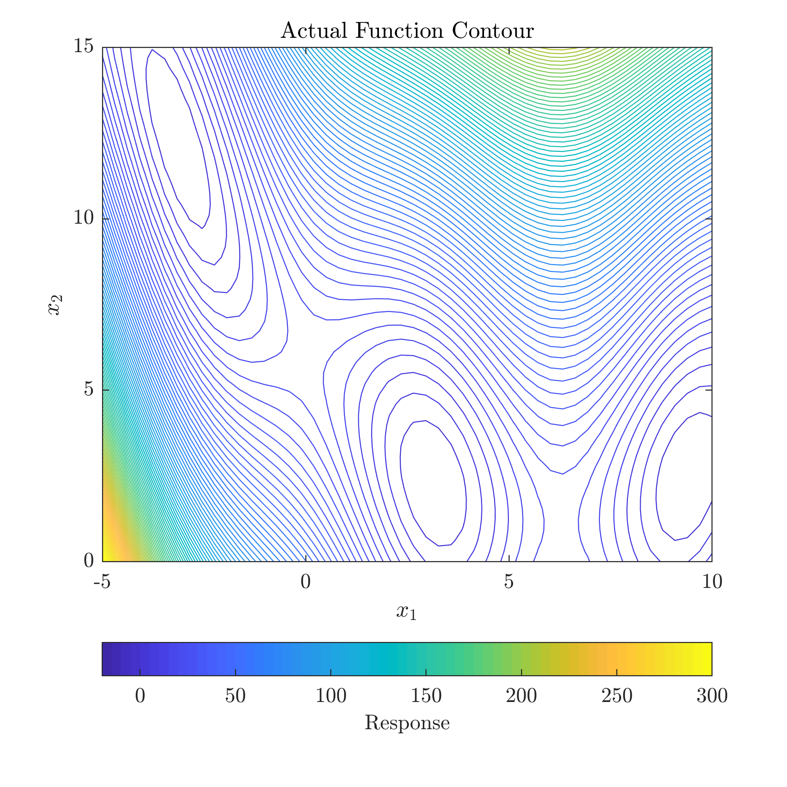

# SLRGP
SLRGP - Sequential Laplacian Regularized Gaussian Process
SLRGP algorithm uses Laplacian regularized active learning measure (LR-AL) to select the next informative evaluation point to efficiently estimate the underlying back-box function. 

Implementation is provided in the folder named Code. Run Main_Gif_SLRGP.m to generate the plots shown below:

